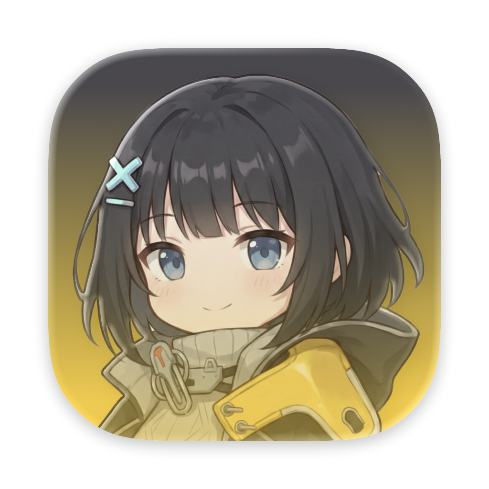

  

  <h1>Endfield Gacha</h1>

  

    <strong>“你好，咕咕嘎嘎！”</strong> 
    一个《明日方舟：终末地》寻访记录统计与分析工具 
    支持 Windows / macOS / Linux
  

  

    
    
    
    
  

---

## 功能特性

### 账号与服务器

- **多账号管理**：支持添加多个账号的多个角色并在顶部下拉切换。
- **国服 / 国际服**：支持国服（官服 / Bilibili 渠道服）与国际服（亚服 / 欧美服）。

### 同步方式

>[!NOTE]
>
> 目前终末地更新至 1.1 版本后客户端 WebView 日志不再出现抽卡相关 URL，`日志同步` 功能目前不可用。
>
> 之前使用 `日志同步` 的可以通过 `添加账号` 方式添加账号后可继续使用，本地用户数据依旧在，不会清空~

- ~**日志同步（仅 Windows）**~：选择 `system(国服)` 或 `system(国际服)` ，从对应的客户端 WebView 日志抓取链接得到 `token`，再解析出 `uid/roleId`，将数据同步到对应的账号中。
- **添加账号同步（推荐）**：应用内打开网页登录并自动抓取 Token，或手动粘贴 Token。

### 同步与数据

- **增量同步**: 通过 `seqId` 判断所需拉取的页数，避免每次均拉取所有分页造成拉取时间过长。
- **全量同步**: 拉取所有分页的数据，用于补充历史遗漏数据。
- **增量追加**：按 `seqId` 去重合并，重复同步不会重复写入，只会追加缺失记录。
- **角色池 / 武器池**：支持角色池与武器池寻访记录同步与统计展示。
- **同步进度可视化**：同步过程中会显示当前卡池名称与分页进度，便于判断同步状态。
- **数据本地保存**：所有数据均保存到本地 `userData/` 下（不同系统路径不同；不上传任何第三方服务器）。
  - 配置文件：`userData/config.json`
  - 卡池信息：`userData/gachaData/poolInfo.json`
  - 寻访记录数据：`userData/gachaData/*.json`

### UI 与体验

- **角色池 / 武器池分页面统计**：支持顶部一键切换角色池与武器池视图。
- **角色池统计**：
  - 多个特许池时可切换“全部”聚合视图
  - 显示当前垫抽、大保底进度、6★ 历史记录
  - 历史记录中支持 `NEW` 标记与“歪”标记
- **武器池统计**：
  - 支持“所有武器池 / 限定武器池 / 非限定武器池”拆分查看
  - 显示当前垫抽与当期 UP 获取状态
  - 支持多池切换与“全部”聚合视图
- **稀有度分布图表**：通过饼图展示 6★ / 5★ / 4★ 分布占比。
- **历史出货统计**：展示各稀有度数量、占比、平均出货抽数与 6★ 历史记录。
- **主题切换**：支持 `跟随系统 / 亮色模式 / 暗色模式`。

### 技术栈

- **前端**：Nuxt 4 + Vue 3 + TypeScript
- **UI**：@nuxt/ui
- **图表**：ECharts
- **桌面端**：Tauri 2

## 界面预览

> 预览图可能与当前版本略有差异，以实际界面为准。

  

## 下载与安装

本工具支持 **Windows / macOS / Linux**

1. 前往 [Releases](https://github.com/bhaoo/endfield-gacha/releases) 页面。
2. 下载最新版本中与你系统对应的安装包（Windows / macOS / Linux）。
   - Windows 可以直接下载便携版（Endfield.Gacha_Portable.exe）
   - Linux 推荐通过 `deb` 方式安装（通过 `AppImage` 安装可能因为 GLib 版本问题导致打开白屏）
4. 运行即可（Windows 请确保应用所在目录具备写入权限，以便创建/写入 `userData/`）。

## 数据存储位置

- **Windows**:  `exe` 同级目录下的 `userData/` 目录中。
- **macOS**: `~/Library/Application Support/com.bhao.endfieldgacha/userData/`
- **Linux**: `~/.local/share/com.bhao.endfieldgacha/userData/`

## 使用说明

### ~日志同步（仅限 Windows 操作系统）~

macOS、Linux 操作系统请使用下方的「添加账号同步」方式登录后同步。

1. 在对应客户端内打开一次 **抽卡记录页**。
2. 打开本工具，账号下拉选择 `system(国服)` 或 `system(国际服)`。
3. 点击“同步最新数据”，会自动识别并保存到对应的 `<uid>_<roleId>.json`。

### 添加账号同步

左上角“添加账号”支持两种方式：

- **应用内打开网页登录并自动抓取 Token**（推荐）
- **手动粘贴 Token**

添加成功后，可在账号下拉选择对应角色进行同步与查看。

> [!CAUTION]
> Bilibili 渠道服 ⚠ 注意
>
> 使用 `添加账号同步` 前，请先前往鹰角网络用户中心 [角色绑定](https://user.hypergryph.com/bindCharacters?game=endfield) 处绑定 Bilibili 服帐号哦~

### 同步数据

1. 先在顶部选择需要查看的角色账号。
2. 点击 **同步最新数据**，执行增量同步。
3. 如果怀疑历史数据缺失，点击 **全量同步** 重新拉取当前卡池全部记录。
4. 同步完成后，可在角色池 / 武器池页面切换查看统计结果。

## 注意事项

- 为了防止频繁请求触发 API 风控，同步过程中连续的请求之间会设置一定的延迟，因此若页数较多，拉取时间会稍长一些，请耐心等待 ❤。

## 免责声明

本项目为非官方工具，与 **鹰角网络 (Hypergryph)** 及其旗下组织/团体/工作室没有任何关联。游戏图片与数据版权归各自权利人所有。

- 本软件按“现状”提供，不保证可用性、稳定性或数据准确性；使用过程中造成的任何数据损失、功能异常或经济损失均由用户自行承担。
- 本软件仅供个人学习与研究使用，禁止商业化使用、再分发或提供任何增值服务；因违反上述限制产生的责任由使用者自行承担。
- 使用本软件需遵守所在地法律法规、游戏/平台服务条款及知识产权要求；如有合规/安全疑虑，请立即停止使用并卸载。
- 本项目不会采集或上传任何个人隐私，所有用户数据与登录凭据仅存储在本地；涉及的游戏数据均由用户自行选择导入/导出。

## 最后

感谢 [@RoLingG](https://github.com/RoLingG)、[@YueerMoe](https://github.com/YueerMoe) 帮助完善后端相关数据。

Copyright &copy; 2026 [Bhao](https://dwd.moe/), under MIT License.
